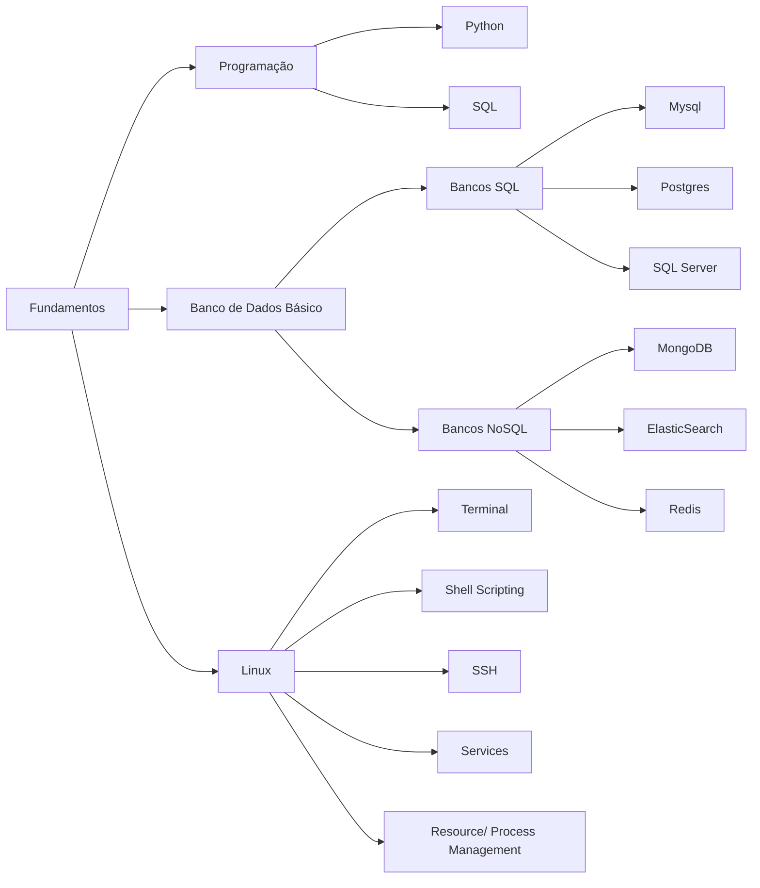
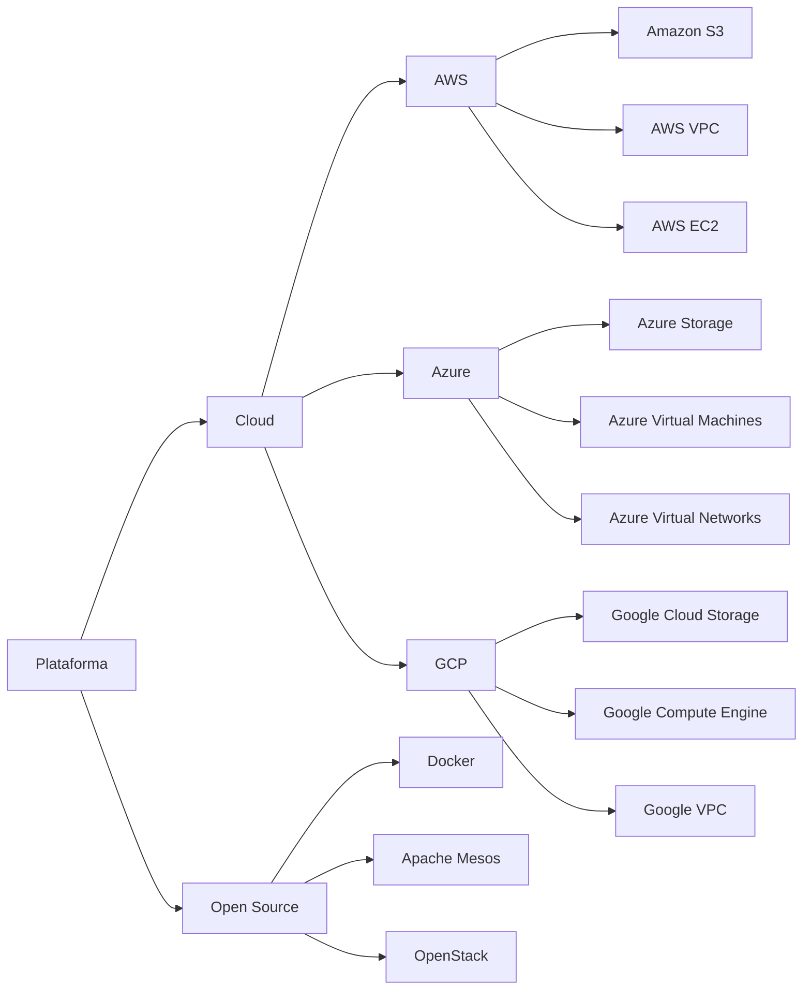
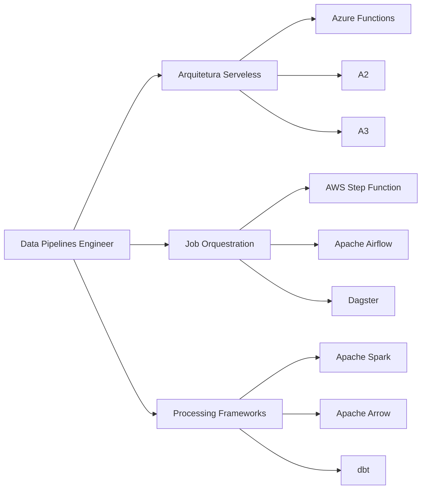
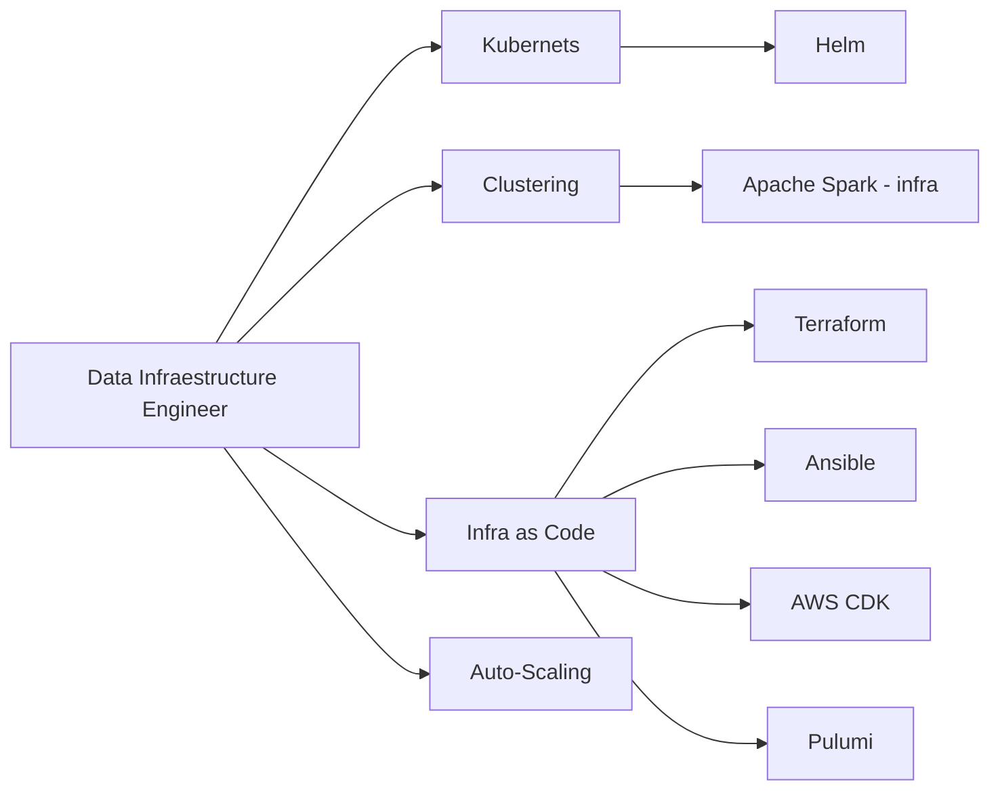

# Como começar em Engenharia de Dados
Este projeto tem o objetivo de organizar conteúdos sobre engenharia de dados,  principalmente em português, para facilitar o aprendizado de quem está entrando na área.

Dividimos os recursos em 4 níveis 

## Roadmap

 
### Nível 1 : Fundamentos <<<< Comece aqui!



##  Programação 

- ### Python
 
    | Site | Título | Nível |

    |:--------|:-------:|--------:|
    |[Python](https://www.python.org//){:target="_blank"}|Python|Básico|
    |[devAnalytics/Youtube](https://www.youtube.com/watch?v=zC0X4CBui-I&list=PLQDFv3ddAPFSwwybX1t5XO7MIyJOTm_Pu){:target="_blank"}|Introdução à Linguagem Python|Básico|
    |[Pandas](https://pandas.pydata.org/){:target="_blank"}|Pandas|Básico|
- ### SQL

    | Site | Título | Nível |

    |:--------|:-------:|--------:|
    |[TeoMeWhy](https://github.com/TeoCalvo/sql_gc){:target="_blank"}|Treinamento SQL|Básico ao avançado|
   
    |[sql-for-data-analysis](https://www.udacity.com/course/sql-for-data-analysis--ud198){:target="_blank"}|Treinamento SQL|Básico|
    
    
    
   
## Banco de dados (Básico)


### Bancos SQL

- #### Mysql
    - [Curso de SQL Completo Gratuito (Softblue)](https://www.softblue.com.br/site/curso/id/3/CURSO+SQL+COMPLETO+BASICO+AO+AVANCADO+ON+LINE+BD03)

- #### Postgres
    - [Treinamento PostgreSQL para DBAs (Ambiente Livre)](https://www.ambientelivre.com.br/treinamento/banco-de-dados/postgresql.html)
- #### SQL Server

### Bancos NoSQL

- #### MongoDB
   - [Treinamento MongoDB (Ambiente Livre)](https://www.ambientelivre.com.br/treinamento/banco-de-dados/mongodb.html)

- #### ElasticSearch
   - [Treinamento ElasticSearch (Ambiente Livre)](https://www.ambientelivre.com.br/treinamento/big-data/elasticsearch.html)

- #### Redis
   - [Treinamento Redis (Ambiente Livre)](https://www.ambientelivre.com.br/treinamento/big-data/redis.html)

## Linux


- ### Terminal 

- ### Shell Scripting

- ### SSH

- ### Services

- ### Resource/ Process Management


**[⬆ Voltar ao início](#roadmap)**


### Nível 2 : Indo para as nuvens!
 

 

## Plataforma
### Cloud
#### AWS
- ####  Amazon S3
    - [Um Inventor Qualquer](https://www.youtube.com/watch?v=ayu9xlQXCYs&list=PLOF5f9_x-OYUaqJar6EKRAonJNSHDFZUm&index=17)
- #### AWS VPC
    - [Um Inventor Qualquer](https://www.youtube.com/watch?v=WMsADIgy4ms&list=PLOF5f9_x-OYUaqJar6EKRAonJNSHDFZUm&index=6)
- #### AWS EC2
    - [Um Inventor Qualquer](https://www.youtube.com/watch?v=a6nU5NTHJDM&list=PLOF5f9_x-OYUaqJar6EKRAonJNSHDFZUm&index=8)

#### Azure
- #### Azure Storage
- #### Azure Virtual Machines
- #### Azure Virtual Networks
- #### [Azure Certification DP-2032](https://github.com/JoseRFJuniorBigData/DP-2003)

#### GCP
- #### Google Cloud Storage
- #### Google Compute Engine
- #### Google VPC

### Open Source
- #### Docker
    - [Treinamento Docker (Ambiente Livre)](https://www.ambientelivre.com.br/treinamento/infraestrutura/docker.html)
- #### Apache Mesos
    - [Treinamento Apache Mesos (Ambiente Livre)](https://www.ambientelivre.com.br/treinamento/hadoop/apache-mesos.html)
- #### OpenStack

 


### Nível 3 : Escolha seu caminho

## Data Pipelines Engineer



### Arquitetura Serveless
- #### AWS Lambda
    - [Um Inventor Qualquer](https://www.youtube.com/watch?v=N5dtRX2PWHY&list=PLOF5f9_x-OYUaqJar6EKRAonJNSHDFZUm&index=19)
- #### Google Functions
- #### Azure Functions

### Job Orquestration
- #### AWS Step Function
- #### Apache Airflow
  - [Supletivo Airflow](https://www.youtube.com/watch?v=f_lnDBR3rFU)
  - https://www.udemy.com/course/the-ultimate-hands-on-course-to-master-apache-airflow
  - https://www.udemy.com/course/the-complete-hands-on-course-to-master-apache-airflow
  - https://www.udemy.com/course/apache-airflow-on-aws-eks-the-hands-on-guide	
  - [Treinamento Apache Airflow (Ambiente Livre)](https://www.ambientelivre.com.br/treinamento/data-science/airflow.html)
- #### Luigi
- #### Prefect
- #### Dagster

### Processing Frameworks
- #### Apache Spark
  - [Supletivo Spark](https://www.youtube.com/watch?v=mrHnb8U4fX4)
- #### Apache Arrow
- #### dbt
  - [Supletivo dbt](https://www.youtube.com/watch?v=96gpDt-MGMM) 
  - [ETL101 - Curso de ETL utilizando o Modern Analytics Stack (Big Query + Stitch + dbt)](https://www.youtube.com/watch?list=PLrJaJt2i__IxReStfKCl88VT4pQxVKRzF&v=1q1P1mP9III)
  - [Treinamento dbt - Analytics Engineering Workflow (Ambiente Livre)](https://www.ambientelivre.com.br/treinamento/data-science/dbt.html)


## Data Infraestructure Engineer
 

### Kubernets
- Helm
### Clustering
- Apache Spark - infra
### Infra as Code
- Terraform
- Ansible
- AWS CDK
- Pulumi
### Auto-Scaling


### Nível 4: Torne-se um Jedi

```
Aprofundamento Geral
    Recursos Computacionais
    Linguagens de Programação
    Data Warehousing
        * Arquiteturas de Schema de DWs;
    Monitoramento
    Segurança
    Data Lakes
        * Arquiteturas de DL;
        * Data Lakehouses;

Arcabouço Teórico
    Algebra linear
    Cálculo numérico
    Recuperação de Informação
    Computação distribuída

Data Governance
    Controle de Acesso SGBDs
    Catálogo de dados
        * Amundsen;
        * Datahub;
        * OpenMetadata;
        * Apache Atlas
    Testes de dados;
        * Great Expectations;
    Auditoria
        LGPD/GPDR

Data Streaming
    Apache Kafka
      -  [Treinamento Kafka Fundamental (Ambiente Livre)](https://www.ambientelivre.com.br/treinamento/big-data/kafka.html)
    AWS Kinesis
    CDC
    Apache Nifi
      - [Treinamento Apache NiFi (Ambiente Livre)](https://www.ambientelivre.com.br/treinamento/hadoop/apache-nifi.html)
    Apache Beam
	    https://www.udemy.com/course/apache-beam-python

Machine Learning Engineering
    Machine Learning
        Aprendizado Supervisionado
        Aprendizado Não-Supervisionado
    Estatística e Probabilidade
    Teste A/B
 
``` 
 ===========================

## Trilhas Pagas:
* Engenheiro de dados do Datacamp; 
* Curso de engenheiro de dados do Google (para Certificação); 
* Engenharia de dados da Udacity;  https://www.udacity.com/course/data-engineer-nanodegree--nd027

  

## Datasets para estudar e criar projetos:
	* Google Bigquery public datasets - https://cloud.google.com/bigquery/public-data;
	* Kaggle Datasets - https://www.kaggle.com/;
	* Portais do Governo;
	* APIs;
	    * Tools:
		* Postman;
		* Imnsonia;
	    * CEP, CNPJs, DDD, FIPE, etc - https://brasilapi.com.br/docs
 
