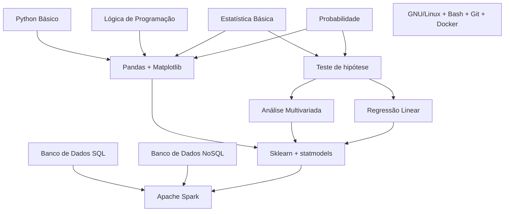

# Como começar em Engenharia de Dados

## Roadmap
Este projeto tem o objetivo de organizar conteúdos, principalmente em português, sobre engenharia de dados para facilitar o aprendizado de quem está entrando na área.
Dividimos os recursos em 4 níveis 
 
### Nível 1 : Comece aqui!

##  Programação 

### Python

### SQL
   
## Banco de dados (Básico)

### Bancos SQL

#### Mysql

#### Postgres

#### SQL Server

### Bancos NoSQL

#### MongoDB

#### ElasticSearch

#### Redis

## Linux

### Terminal 

### Shell Scripting

### SSH

### Services

### Resource/ Process Management

**[⬆ Voltar ao início](#roadmap)**
### Nível 2 : Indo para as nuvens!

Plataforma
    Cloud
        AWS
            Amazon S3
            AWS VPC
            AWS EC2
        Azure
            Azure Storage
            Azure Virtual Machines
            Azure Virtual Networks
        GCP
            Google Cloud Storage
            Google Compute Engine
            Google VPC
    Open Source
        Docker
        Apache Mesos
        OpenStack

### Nível 3 : Escolha seu caminho

Data Pipelines Engineer
    Arquitetura Serveless
        AWS Lambda
        Google Functions
        Azure Functions
    Job Orquestration
        AWS Step Function
        Apache Airflow
        Luigi
        Prefect
    Processing Frameworks
        Apache Spark
        Apache Arrow

Data Infraestructure Engineer
    Kubernets
        Helm
    Clustering
        Apache Spark(infra)
    Infra as Code
        Terraform
        Ansible
        AWS CDK
        Pulumi
    Auto-Scaling

### Nível 4: Torne-se um Jedi

Aprofundamento Geral
    Recursos Computacionais
    Linguagens de Programação
    Data Warehousing
    Monitoramento
    Segurança
    Data Lakes

Arcabouço Teórico
    Algebra linear
    Cálculo numérico
    Recuperação de Informação
    Computaçãoi distribuída

Data Governance
    Controle de Acesso SGBDs
    Catálogo de dados
        Amundsen
        Apache Atlas
    Auditoria
        LGPD/GPDR

Data Streaming
    Apache Kafka
    AWS Kinesis
    CDC
    Apache Nifi

Machine Learning Engineering
    Machine Learning
        Aprendizado Supervisionado
        Aprendizado Não-Supervisionado
    Estatística e Probabilidade
    Teste A/B
 

 

## Trilhas Pagas:
* Engenheiro de dados do Datacamp;
    * 

* Curso de engenheiro de dados do Google (para Certificação);
    * 

* Engenharia de dados da Udacity;  https://www.udacity.com/course/data-engineer-nanodegree--nd027

## Banco de Dados 

SQL

	
- [X] link de tutorial sql
- [X] link de tutorial sql

NoSQL

	
- [X] link de tutorial 
- [X] link de tutorial 

Colunar - Snowflake

	
- [X] link de tutorial 
- [X] link de tutorial 

Colunar - BigQuery

	
- [X] link de tutorial 
- [X] link de tutorial 

Colunar - Redshift

	
- [X] link de tutorial 
- [X] link de tutorial 

## Orquestração
	MUST Apache Airfllow
		- https://www.udemy.com/course/the-ultimate-hands-on-course-to-master-apache-airflow
		- https://www.udemy.com/course/the-complete-hands-on-course-to-master-apache-airflow
		- https://www.udemy.com/course/apache-airflow-on-aws-eks-the-hands-on-guide	
	NICE Prefect
	NICE Dagster
	NICE Luigi
		
## Processamento:
	* Python/Pandas;
	* Spark;
	* dbt;

## Infraestrutura:
	* Ambientes Virtuais:
	* Docker;
	* Kubernetes;
	* Cloud (pelo menos um);
	     * AWS;
	     * GCP;
	     * Azure;

## Datasets para estudar e criar projetos:
	* Google Bigquery public datasets - https://cloud.google.com/bigquery/public-data;
	* Kaggle Datasets - https://www.kaggle.com/;
	* Portais do Governo;
	* APIs;
	    * Tools:
		* Postman;
		* Imnsonia;
	    * CEP, CNPJs, DDD, FIPE, etc - https://brasilapi.com.br/docs

## Teoria:
* MUST Data lakes;
	* Arquiteturas de DL;
* MUST Data Warehouses;
	* Arquiteturas de Schema de DWs;
* Data Lakehouses;

## Avançado:

* Testes de dados;
    * Great Expectations;
* Catalogo de dados:
    * Amundsen;
    * Datahub;
    * OpenMetadata;
* Streamming:
    * Apache Beam
	https://www.udemy.com/course/apache-beam-python
* Mensageria
* Replayable Logs
    * Kafka;
